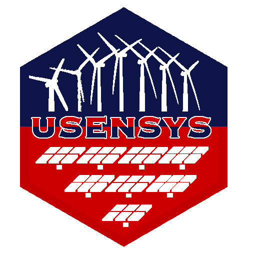

<!-- README.md is generated from README.Rmd. Please edit that file -->

# <u>U</u>nited <u>S</u>tates <u>En</u>ergy <u>Sys</u>tem Optimization Model 

<!-- badges: start -->

[](https://lifecycle.r-lib.org/articles/stages.html#experimental)
[](https://CRAN.R-project.org/package=usensys)
[](code_of_conduct.md)

<!-- badges: end -->

<div class="warn">

> :warning: **This package is under development.**  
> The expected release date of the first minimal *beta*-version is
> 2024-09-30.  
> Docs in progress: <https://usensys.github.io/usensys/>

</div>

**USENSYS** is a linear programming optimization model for the United
States energy system. It belongs to a class of models known as **Macro
Energy Models**, also called **Reference Energy System Models** or
**Capacity Expansion Models** (particularly in the context of the
electric power sector). USENSYS optimizes the long-term development of
the energy system considering alternative technological options,
available resources, and policy options. Its primary objective is to
determine the cost-optimal capacity expansion of technological chains
while accounting for the current state of the system, resource- and
policy-constraints.

The **usensys** package provides an R interface for this model, offering
functions to either design new versions or utilize a pre-configured one.
It enables users to set up inputs for scenarios, run simulations, and
analyze outcomes. This framework can be particularly useful for
**academic researchers** and **consultants** specializing in energy
systems and policy analysis, who is familiar with R, as it integrates
seamlessly with existing data analysis and visualization tools.
\[*Native Python and Julia interfaces with equivalent features are under
consideration*.\]

### Motivation

The **usensys** project is driven by the following goals:  
- A universal interface for a versatile, scalable modeling framework  
- Open-source accessibility, free use, and development  
- Transparency in modeling assumptions and results  
- Community building to foster collaboration  
- More and better research through collective efforts.

As open-source models are increasingly becoming the standard and best
practice in energy modeling, USENSYS aims to contribute to this trend by
providing transparency and accessibility.

## Features

As a Macro/Reference Energy System model, USENSYS can be used to
simulate energy pathways by optimizing energy investments over multiple
decades under various conditions. It enables scenario analysis involving
different technological options, costs, policy measures, energy demand,
economic structures, and other key assumptions.

The package emphasizes flexibility in both data and model structure,
adopting a modular approach that facilitates customization of data
sources and model components. The model is built on the **energyRt**
R-package, a model generator that includes a framework of approximately
one hundred pre-built constraints, providing significant flexibility in
designing technologies, sectors, and linkages. These constraints are
activated based on model or scenario-specific data. Users can also add
custom constraints via the R interface, allowing further adaptability.
No operational research programming is required to run the suite of
models.

## Versions

Several versions of USENSYS are available, each at different stages of
development. All versions are included in the package and differ in
their geographical scope, regional aggregation, data sources, or in some
cases, replicate existing models developed by institutions like **EPA**
and **NREL**. Currently, USENSYS focuses on the electric power sector,
but future versions will extend to other economic sectors.

The following versions are in preparation for release:  
- **26-zones**: Divides the United States into 26 zones based on
**NERC** sub-regions. This version is part of the Multimodel
Intercomparison Project (MIP) and uses **PowerGenome** data.  
- **50-states**: Covers all 50 U.S. states, including **Alaska** and
**Hawaii**, with data from **EIA** and **NREL ATB**. This version
facilitates integration with other sectors and supports state-level
policy analysis.  
- **IPM**: Based on the **IPM model** developed by **EPA**, with data
sourced from **IPM** and **NREL ATB**. - **IPMX**: An extension of the
IPM model that includes **Mexican states**.  
- **ReEDS**: A replica of the **ReEDS model** by **NREL**, with data
imported from the ReEDS repository.

## Data sources

The data options include several datasets, **EIA**, **NREL**, **IPM**,
**ReEDS**, **MERRA2**, also data assemblies/processing tools such as
**PUDL** and **PowerGenome**. The package provides functions to load and
preprocess these datasets, making it easier to set up scenarios and run
simulations. The package is designed to be flexible, allowing users to
incorporate their own data sources and customize the model to their
needs.

## Prerequisites

To run the USENSYS model, you need one of the following optimization
software packages:  
- [Julia](https://julialang.org/) with [JuMP](https://jump.dev/)  
- [Python](https://www.python.org/) with
[Pyomo](https://www.pyomo.org/)  
- [GLPK](https://en.wikibooks.org/wiki/GLPK/GMPL_(MathProg)) (with
MathProg/CMPL – a subset of [AMPL](https://ampl.com/))  
- [GAMS](https://www.gams.com/)  

The first three options are open-source and free, while **GAMS** is
commercial software. Large problems typically require a commercial
linear *solver*, such as [CPLEX](https://en.wikipedia.org/wiki/CPLEX) or
[Gurobi](https://en.wikipedia.org/wiki/Gurobi_Optimizer), connected to
the optimization software. Smaller models can be solved with open-source
solvers like [HiGHS](https://highs.dev/),
[CBC](https://coin-or.github.io/Cbc/intro.html), or
[GLPK](https://www.gnu.org/software/glpk/).

The hardware requirements depend on the size of the model and the solver
used:

- **Small problems**: Can be solved on a personal computer with 8 GB of
  RAM and a modern processor using solvers like **HiGHS** or **CBC**,
  usually within minutes.  
- **Large problems**: Such as those involving numerous zones,
  technologies, or time periods, may require a high-performance
  multicore computer or cloud service with 200 GB or more of RAM, with
  computation times ranging from hours to days.

## Installation

You can install the development version of usensys from
[GitHub](https://github.com/) with:

``` r
# install.packages("pak")
pak::pkg_install("energyRt/energyRt")
pak::pkg_install("usensys/usensys")
```

## Example

This is a basic example which shows you how to solve a common problem:

``` r
library(usensys)
## basic example code
```

:construction: **This document is under construction.**
